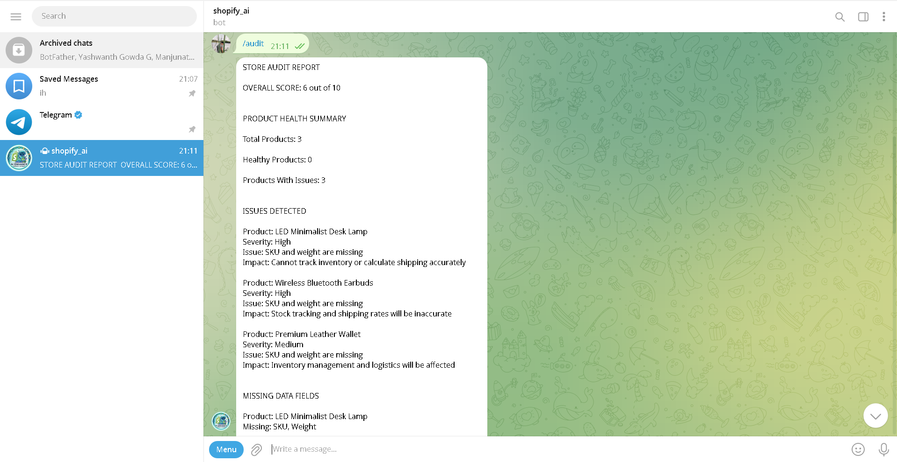

# Perceptra — AI Store Readability Auditor

> Help Shopify merchants understand how AI shopping agents perceive their store — and what to fix.


## The Problem

AI agents inside platforms like ChatGPT, Google Shopping, Perplexity, and Amazon Rufus are making shopping decisions on behalf of users. These agents browse, compare, and recommend products automatically.

Most independent Shopify merchants are invisible to these agents — not because their products are bad, but because their store data is incomplete, unclear, or unstructured.

To a human, the store looks fine. To an AI agent, it looks like noise.

So the agent skips it.


## What We Built

A conversational AI agent that connects to a Shopify store through Telegram and audits it the way an AI shopping agent would.

The merchant connects their store in under 2 minutes. After that, everything is one tap.


## Features

| Command | What it does |
|---|---|
| `/start` | Connect your Shopify store |
| `/audit` | Full store readability report with score out of 10 |
| `/fix` | AI rewrites for weak or missing product descriptions |
| `/perception` | See how AI shopping agents currently view your store |
| `/chat` | Ask questions about your store products |
| `/status` | Check which store is connected |


## How It Works

```
Merchant sends message on Telegram
        ↓
n8n receives and routes the message
        ↓
Google Sheets fetches saved store credentials
        ↓
Shopify Admin API fetches product and page data (read-only)
        ↓
Ollama (Gemma3:1b) analyzes the data locally
        ↓
Gemini API as fallback if Ollama is unavailable
        ↓
Structured report sent back to merchant on Telegram
```

---

## Tech Stack

| Tool | Purpose |
|---|---|
| Telegram Bot API | Merchant interface |
| n8n (cloud) | Workflow automation |
| Shopify Admin API | Read-only store data access |
| Ollama + Gemma3:1b | Local LLM — keeps data private |
| Gemini 2.0 Flash | Fallback LLM |
| ngrok | Tunnel for local Ollama |
| Google Sheets | Merchant credential storage |


## Setup Guide

### Step 1 — Create Telegram Bot

1. Open Telegram and search for `@BotFather`
2. Send `/newbot` and follow the steps
3. Copy the bot token

### Step 2 — Set Up n8n

1. Create a free account at [n8n.cloud](https://n8n.cloud)
2. Import the workflow JSON from this repo
3. Add your Telegram bot token as a credential

### Step 3 — Set Up Google Sheets

Create a sheet called `merchants` with these columns:

```
chatId | storeURL | token
```

### Step 4 — Run Ollama Locally

```powershell
# Kill existing Ollama instance
taskkill /F /IM ollama.exe

# Start Ollama with external access
$env:OLLAMA_ORIGINS="*"; $env:OLLAMA_HOST="0.0.0.0"; ollama serve

# Load model in new terminal
ollama run gemma3:1b
```

### Step 5 — Expose Ollama with ngrok

```bash
ngrok http 11434
```

Copy the forwarding URL and update it in the n8n HTTP Request nodes for Ollama.

### Step 6 — Add Gemini API Key (Fallback)

1. Get a free API key from [aistudio.google.com](https://aistudio.google.com)
2. Add it to the Gemini HTTP Request nodes in n8n

### Step 7 — Activate Workflow

Go to n8n → open the workflow → toggle it to **Active**


## Connecting Your Shopify Store

### Step 1 — Create a Custom App in Shopify

1. Go to Shopify Admin → Settings → Apps → Develop Apps
2. Click Create App
3. Set permissions:
   - `read_products`
   - `read_content`
4. Install the app and copy the API token

### Step 2 — Connect via Telegram

1. Open the bot on Telegram
2. Send `/start`
3. Send your store URL (e.g. `yourstore.myshopify.com`)
4. Paste your API token

The bot validates the token instantly and saves it. You never need to enter it again.


## Architecture Decisions

**Why Telegram instead of a web dashboard**
Merchants already use Telegram. Zero onboarding friction. Works on any phone without installing anything new.

**Why Ollama as primary LLM**
Merchant store data stays private. No API costs per request. Gemini is only used as a fallback when Ollama is unavailable.

**Why n8n instead of custom backend**
Faster to build. Visual workflow makes debugging easy. Built-in error handling and fallback logic.

**Why Google Sheets instead of a database**
Zero infrastructure setup for MVP. Simple and fast to implement. Would be replaced with a proper database in production.

**Why read-only Shopify access**
Builds merchant trust. Eliminates risk of accidental data changes. Bot can analyze but never modify.


## Known Limitations

- ngrok URL changes every session — must update in n8n manually on each restart
- Gemma3:1b is a small model — output quality is limited for complex stores
- Google Sheets is not suitable for production scale
- No audit history — merchants cannot track score changes over time


## What We Would Improve With More Time

- Replace ngrok with Cloudflare Tunnel for a permanent free URL
- Add audit history so merchants can track progress over time
- Replace Google Sheets with a proper database
- Add scheduled weekly audit reports sent automatically
- Use a larger LLM for higher quality output
- Build a simple web dashboard for merchants who prefer it


## Screenshots



## Team

**Perceptra**
- Navaneeth Gowda G
- Manjunath H

Built for Kasparro Hackathon — Track 5: AI Representation Optimizer


## Demo

Telegram Bot: [@ai_shopifybot](https://t.me/ai_shopifybot)

Video Demo : https://drive.google.com/drive/folders/1h9jiKE9bAcHPgTOMmSS_1kolOh13vdYW?usp=drive_link
